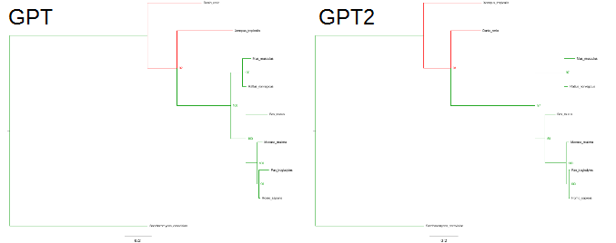
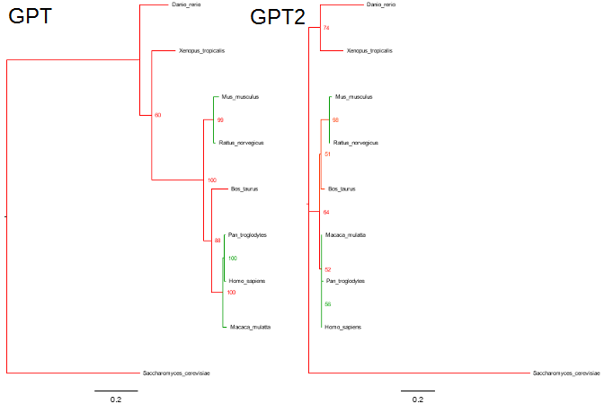
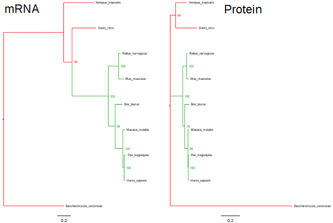
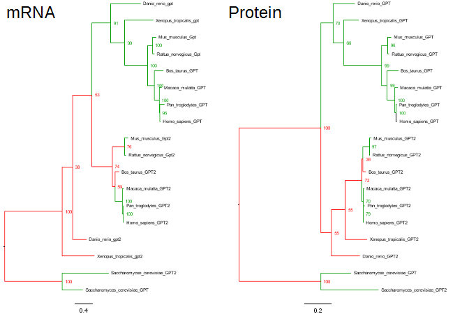

# Phylogenetic Biology - Final Project

# A Phylogenetic Analysis of GPT and GPT2 evolution

## Introduction and Goals

GPT2 is a chromosomal gene that encodes glutamic pyruvate transaminase 2. This protein is expressed in the mitochondria of humans and is used to convert alanine to glutatamate. GPT2 also has a sister gene GPT which is expressed in the cytoplasm. These proteins are sometimes referred to as alanine aminotransferase in reference to the reverse reaction. 

For my project, my goal would be to construct a phylogeny of the genes from a number of species and track whether the genes that are cytoplasmic and mitochondrial form seperate clades. This could be used to answer the question as to whether the localizations developed independently or were present in a most recent common ancestor. 
I propose the following methods. First, I will reconstruct the tree using GPT2 and GPT data seperately. I will also reconstruct the tree using a combined sequence. This method of tree reconstruction will be similar to the process outlined in Cartwright et al 2008. I also think that it would be interesting to perform a similar analyis using protein sequence data as opposed to the genes. This kind of analysis is discussed in Rokas 2011. 

I plan to use sequence data from NCBI and Homologene. I will also use Homologene in order to identify the homologs of GPT and GPT2. The use of Homologene in constructing phylogenies is discussed in Altenhoff et al (2009). I also plan on using gene databases and literature searches to determine the expression location of the proteins. 

## Methods

For my methods, I adapted a similar process to that of the Hydroidolina assignment.

First, I used homologene to identify gene and protein assession numbers for gene families. Homologene is a database that automatically identifies homology groups from the NCBI reference genomes. To achieve this, it works by using blastp to identify highly conserved amino acid sequence. 

For my project, I looked at the homologene results for GPT and GPT2 and identified the accession IDS for 9 species that overlapped between the sets. For each gene, there were a few species that were not further studied as they did not overlap. These accession IDs are listed in the four .txt files in the data directory. They are labeled in the format PROTEINNAMEdatatype where proteinids contain Amino Acid sequences and seqids contain mRNA data. 

Using these accession IDs, I used NCBI batch download to obtain FASTAs for these IDs. These resulting files are saved as the .raw.fasta files in the data folder. Files with a .protein extension before the .raw.fasta contain amino acid data. The raw FASTA files were then cleaned. Initially, I used a sed command to format the names, but after looking at the new names, it became clear that subtle differences in naming resulted in messy names. Because of the limited number of taxa (9 per file), I decided it would be better to manually rename the sequences. These renamed files are also included in the data directory with the extension now simply .fasta. 

Two further fasta files were also made at this point. These files mRNA.all.fasta and protein.all.fasta include the mRNA or amino acid sequences from both the GPT and GPT2 sequences. Because of the variety of names for each gene, they were labeled as with Species name followed by GPT or GPT2 depending on which homologene family they were from. Table 1 includes the real name for each sequence. It should be noted that for X. tropicalis, the two genes share the same name but differ in locus and sequence and belong to different protein families.

### Table 1

| Species                  | Protein Family | Gene Name |
|--------------------------|----------------|-----------|
| Homo sapiens             | GPT            | GPT       |
| Pan troglodytes          | GPT            | GPT       |
| Macaca mulatta           | GPT            | GPT       |
| Bos taurus               | GPT            | GPT       |
| Mus musculus             | GPT            | Gpt       |
| Rattus norvegicus        | GPT            | Gpt       |
| Xenopus tropicalis       | GPT            | gpt2      |
| Danio rerio              | GPT            | gpt2l     |
| Saccharomyces cerevisiae | GPT            | ALT2      |
| Homo sapiens             | GPT2           | GPT2      |
| Pan troglodytes          | GPT2           | GPT2      |
| Macaca mulatta           | GPT2           | GPT2      |
| Bos taurus               | GPT2           | GPT2      |
| Mus musculus             | GPT2           | Gpt2      |
| Rattus norvegicus        | GPT2           | Gpt2      |
| Xenopus tropicalis       | GPT2           | gpt2      |
| Danio rerio              | GPT2           | gpt2      |
| Saccharomyces cerevisiae | GPT2           | ALT1      |

With the FASTA files generated, alignments were then performed. The aligments were made using mafft. The resulting alignments are stored in the alignments directory. In order to run the alignment the alignment.sh script was run with the following command: `sbatch -t 12:00:00 alignment.sh`. These are converted to .nex and .phy files using Mesquite.

A concatenated alignment was made using phyutility.jar. A copy of this jar is included in the main directory. It should be noted that for the concatenated amino acid alignment, phyutility outputs the file stating that it is DNA data so, I needed to manually change the line in the .nex file from DNA to Protein. The concatenated files were converted to .phy using Mesquite. The phyutility commands (run in the alignments directory) were: `java -jar ../phyutility.jar -concat -in gpt.align.fasta gpt2.align.fasta -out combined.mrna.nex` and `java -jar ../phyutility.jar -concat -in gpt.protein.align.fasta gpt2.protein.align.fasta -out combined.protein.nex`.

With all of the alignments generated, the trees were constructed using RAxML. The commands to run this are included in the raxml.sh script which can be run using `sbatch raxml.sh`. For the mRNA data, the GTRGAMMA model was used. For the amino acid data, the PROTGAMMAWAG model was used. This is based off of the WAG amino acid subsitution matrix. 

The trees were then viewed using Figtree. 

## Results

The results presented here are using the RAxML bipartitions file with their bootstrap values as node labels. All trees were rerooted using Saccharomyces cerevisiae as a rooting branch because it is the only non-animal in the included taxa. 

Figure 1 shows the predicted trees using mRNA data. The only branches that are different are marked in red. The rest are in green. 

### Figure 1

Figure 2 shows the predicted trees using the amino acid data. The only branches that are different are marked in red. The rest are in green. 

### Figure 2

Figure 3 shows the predicted trees using the concatenated data. The mRNA is on the left and the amino acid is on the right. The only branches that are different are marked in red. The rest are in green. 

### Figure 3

Figure 4 shows the predicted trees for both when GPT and GPT2 data are aligned. The tree on the left is generated using mRNA data and the tree on the right is generated using amino acid data.  Differences between the trees are highlighted in red with shared branches in green. Because of the distinct cluster for S. cerevisiae's protiens they were used to root the tree. 

### Figure 4

## Discussion

After having downloaded all of the data and performed all the phylogenetic analyses, I went back to gather data on the localization of these proteins in each species. Unfortunately, at this point, I discovered that for the majority of the species, the cellular localizations of these proteins have not been characterized. In particular, I was able to find evidence for the cytosolic localization for GPT in humans, mice, and rats. These species were also consistent with the mitochondrial localization of GPT2. For the rest of the species, there was no data suggesting one way or the other. 

This limitation on trait data limited the depth of the analysis to some degree. However, a few trends were still evident from the data that was gathered. As a whole the trees produced when comparing the two genes and the concatenated results were highly similar. They also generally mapped the accepted relationships between species. For example, the two rodents were always grouped together as were humans, chimpanzees, and monkeys. These groups always featured high bootstrap values. There was more difficulty in resolving the placements of zebrafish and frogs. These two were always the most distantly related other than yeast but their order often switched. 

These data also showed the difference in resolution between RNA and amino acid data. The trees constructed with amino acid data have more conflicts between them than the RNA data. This makes sense as the resolution is much smaller for amino acids as each amino acid condense the data from 3 base pairs which mens the sequences of amino acids are shorter than the RNA data. 

In terms of the major question I was trying to answer, Figure 4 most directly addresses this. In both species, we see a seperate clade for the yeast proteins suggesting an earlier ancestor that they diverged from prior to all of the other proteins (this is interesting as homologene had them in different families). In the mRNA data, a clade is formed from all of the other GPT proteins. Most of the GPT2s also form a clade but the zebrafish and frog are excluded from the data. For the protein data, the two protein groups form clear clades. Because of the lack of molecular characterization, I was not able to confirm the protein localization throughout the clades but in general, the resulting trees suggest that two distinct proteins were present in a most recent common ancestor as opposed to one protein that has branched in different species. 

I had a few difficulties in implementing these analyses. First, when running RAxML, I wanted to have the results output to a different directory. However, because of how RAxML outputs error messages, I spent a long time not realizing that I needed a separate flag and the full path. This was in the manual but I missed it at first and the error messages made it difficult to identify the problem so I spent a long time debuging. In the end, I just modified my script to move the files at the end as opposed to using the flag and path. 

I also had problems with the phyutility. As I mentioned in the methods, I think there is a bug in that it outputs all files as DNA data, so I had to manually change that output to use it with Mesquite. 

Beyond the technical difficulties, as I was trying to confirm the evolutionary relationships that were fairly intuitive (eg. Yeast is more distantly related than rest of species), I realized how difficult it is to search for already existing phyologenies. I think it would be a great benefit if someone used already existing data to create a database that would allow you to input a set of species and would return a predicted tree for those species. While this would be difficult for closely related species where there are conflicts in proposed evolutionary relationships, it would be useful for more distantly related species. For example, I was unsure exactly where cows should fall in the tree that I constructed but I could not find a way to place it within the other mammals. 

If I did these analyses again, I would try to have more taxa and better molecular characterizations of the protein localizations. Both of these would improve the depth of the data and potentially provide better resolution to my overall question. 

## References

> Cartwright, P., Evans, N. M., Dunn, C. W., Marques, A. C., Miglietta, M. P., 
Schuchert, P., & Collins, A. G. (2008). Phylogenetics of Hydroidolina 
(Hydrozoa: Cnidaria). Journal of the Marine Biological Association of the UK, 
88(08), 1663-1672. 
[doi:10.1017/S0025315408002257](http://dx.doi.org/10.1017/S0025315408002257)

> Rokas, A. (2011). Phylogenetic Analysis of Protein Sequence Data Using the Randomized Axelerated Maximum Likelihood(RAXML) Program. Current Protocols in Molecular Biology. Published online. 
[doi:10.1002/0471142727.mb1911s96]

> Altenhoff, A. and Dessimoz, C. Phylogenetic and Functional Assessment of Orthologs Inference Projects and Methods. (2009).
-PLoS Computational Biology. 5(1): e1000262. 
[doi: 10.1371/journal.pcbi.1000262]
