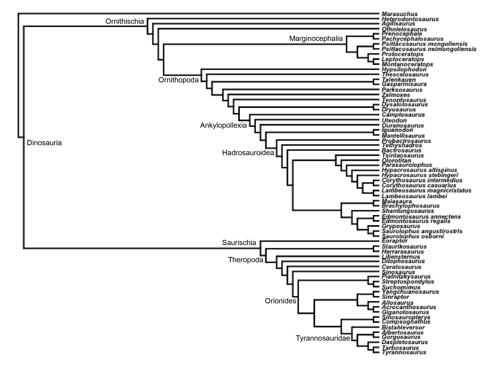
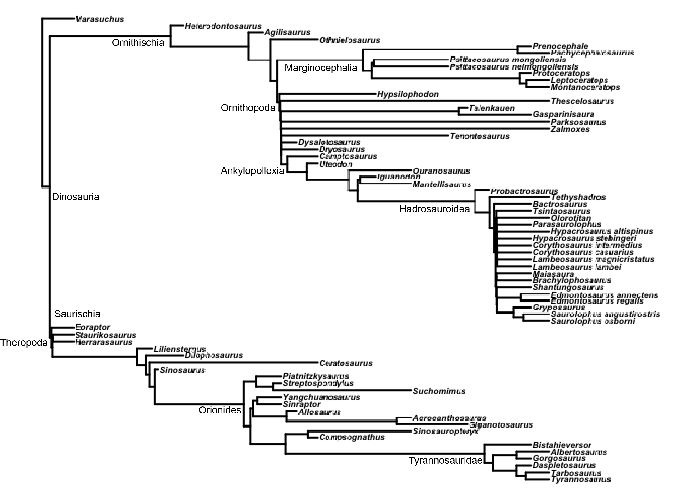
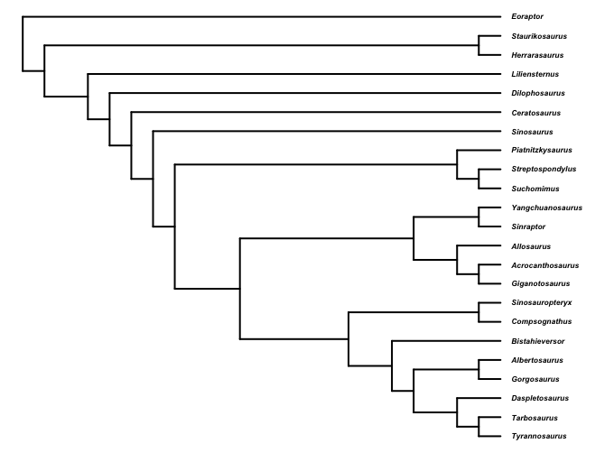
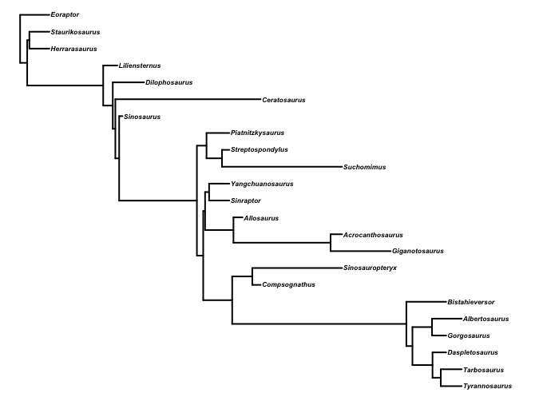
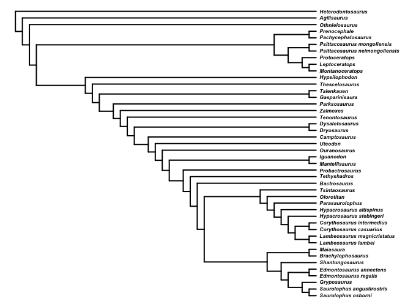
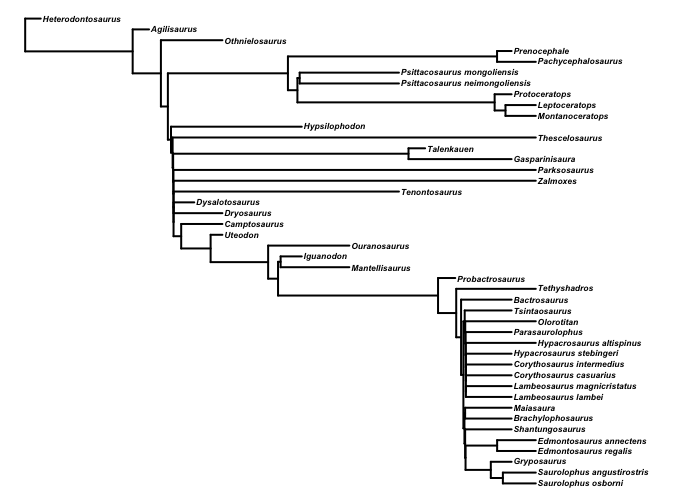
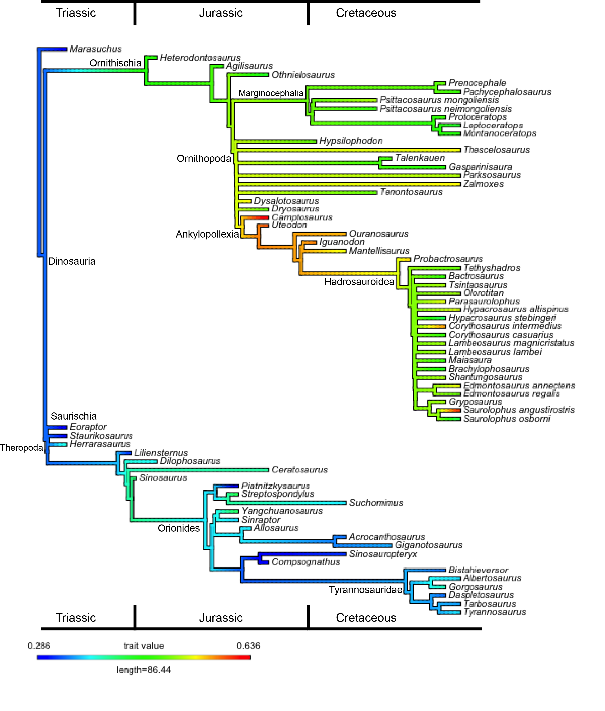
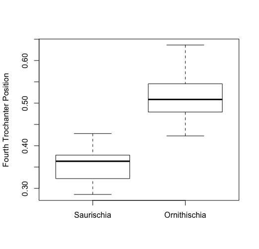
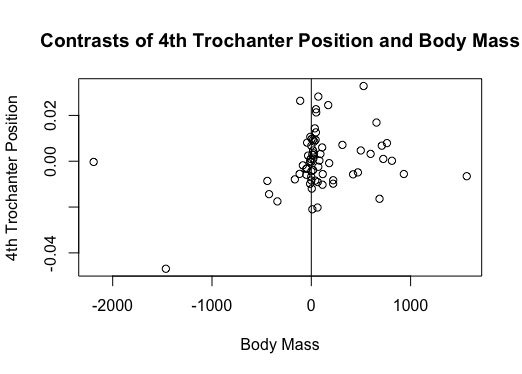

# The Evolution of the Fourth Trochanter in Dinosauria

## Introduction and Goals

The fourth trochanter is a prominent bony process found on the femur of archosaurs, onto which the *M. caudofemoralis longus* and *M. caudofemoralis brevis* muscles insert. The caudofemoralis longus (CFL, for short) is the primary driver of hindlimb locomotion in modern crocodylians (Gatesy, 1990) and is thought to have played the same role in non-avian dinosaurs (Persons and Currie, 2014). The morphology of the fourth trochanter can reveal important information about the structure and dynamics of the CFL, and thus must be considered when trying to reconstruct the locomotor abilities of extinct archosaurs. The fourth trochanters of ornithischian dinosaurs are distinctive from those of other dinosaurs; specifically, their fourth trochanters tend to be larger and more distally positioned than those of related species. 

The basic principles of muscle dynamics suggest that their CFL musculature would have functioned differently due to their unique morphology; by positioning the insertion point of the CFL further from the axis of femoral rotation, they would have lengthened the muscle's in-lever arm and increased its mechanical advantage (at the expense of maximum speed). Some researchers have begun to postulate how this would have impacted their ecology (Persons and Currie, 2014); however, any anatomically-based discussion of ornithischian ecology must take into account the phylogenetic distribution of their characteristic fourth trochanters. So far, no researchers have attempted to track this feature through ornithischian phylogeny.

The most recently-proposed behavioral hypothesis regarding fourth trochanter anatomy is that proposed by Persons and Currie (2014), who suggest that the increased mechanical advantage of ornithischian CFLs was an adaptation to predatory pressure from tyrannosaurid dinosaurs. They argue that the increased mechanical advantage of ornithischian CFLs enabled them to sustain locomotion at a (low) top speed for a long time - in contrast with tyrannosaurs, which they interpret as being fast sprinters who would quickly tire in a protracted pursuit. The Persons and Currie (2014) model is predicated on two assumptions, neither of which they test: A) that the fourth trochanter position in ornithischian dinosaurs was statistically distinct from that found in tyrannosaurs (that is, that the pattern they notice in three taxa is representative of persistent differences in the locomotor strategy of two clades), and B) that ornithischians acquired their peculiar morphology in response to the evolution of tyrannosaurs, which are (based on multiple lines of evidence) interpreted as generally faster runners than most other theropod dinosaurs (Hutchinson and Garcia, 2001; Hutchinson et al. 2011; Persons and Currie, 2014).

Persons and Currie (2014) also fail to account for the potential influence of body mass on fourth trochanter position. Animals of greater body mass necessarily require more force per unit time to move than their smaller relatives; thus, it stands to reason that larger dinosaurs would try to increase the mechanical advantage of their muscles. The ornithischian taxon examined by Persons and Currie (2014) belonged to a very large genus (*Lambeosaurus*), which was potentially larger than both of the tyrannosaurid species examined in the same study. Thus, the conclusion of their paper is potentially a chance result due to differences in scale, not different evolutionary strategies. In summary, the conclusions reached by Persons and Currie (2014) are weakened by their failure to track the phylogenetic history of the characteristic ornithischian fourth trochanter, their lack of a rigorous statistical comparison between ornithischians and other dinosaurs, and their consideration of only very large taxa. 

In this project, we attempt to examine this problem in more detail, and validate or disprove the assumptions raised in Persons and Currie (2014). We first track the phylogenetic history of ornithischian fourth trochanters, to test the hypothesis that their distinctive morphology arose in response to the evolution of tyrannosaurids. We then test for a phylogenetic signal in the data, to see if fourth trochanter position is more associated with particular clades than would be expected by chance. Finally, we examine fourth trochanter position with respect to body mass to see if they show any association.

## Methods

### Data Collection

The data for this project were mostly collected from Gregory S. Paul's *The Princeton Field Guide to Dinosaurs* (Paul, 2010), which contains skeletal illustrations and body mass estimates for many well-known dinosaur taxa. Some skeletal measurements were taken from the website "Skeletal Drawing" (Hartman) when Paul (2010) lacked an appropriate figure. We collected data for 68 taxa: 23 saurischian dinosaurs, 44 ornithischian dinosaurs, and the non-dinosaurian dinosauromorph *Marasuchus* (included as the outgroup). Data were only collected for bipedal or facultatively bipedal animals, because of the potential biases that would be introduced if we included taxa with a fundamentally different style of locomotion (many of which were also extremely large). As a result of excluding quadrupedal forms, the saurischians in our dataset are predominantly theropods, and the ornithischians are predominantly ornithopods. Since theropods likely preyed on ornithopods extensively, this analysis may hold relevance to examining the ecological interactions of the two clades.

To compare the position of the fourth trochanter among the taxa, we took two measurements - one to determine the figured length of the whole femur, and of the distance from the head of the femur to the apex of the fourth trochanter. The latter measurement was divided by the former to yield "fourth Trochanter Position", which describes the percentage down the femur's length at which the fourth trochanter's apex (and the insertion of the CFL tendon) occurs. These measurements were taken directly with a ruler for figures found in Paul (2010); images from (Hartman) were imported into Adobe Photoshop and measured using its inbuilt ruler tool.

After initial data collection, a phylogenetic tree was assembled in Newick format, comprising of all taxa for which we had collected data. The phylogeny was based on published trees; we referenced many papers in order to cross-check our composite tree and ensure accuracy. There was minimal disagreement between the published trees. We used two general rules while assembling the composite tree: 1) when a taxon's placement differed between papers, preference was given to the more recently published tree and 2) when the phylogenetic resolution between different taxa was greater on one tree than on another, preference was given to the finer-resolved tree regardless of which tree was more recently obtained. The resulting composite phylogenetic tree does not contain any polytomies, and given the method of construction of the tree, represents the most up-to-date knowledge of the relationships between these taxa.

The composite tree was imported into R using the **read.tree()** function from the package **ape**. After this, we constructed two sub-trees; one representing Ornithischia and the other Saurischia. This allowed us to analyze the two clades of interest in detail and see if any results were the result of intra- or inter-clade differences.

### Construction of a Time-Calibrated Phylogenetic Tree

At this stage, the composite tree was not scaled to time, and showed only the interrelationships of the constituent taxa. However, the statistical techniques we hoped to use required that the branches of the phylogeny must be scaled to time. Obtaining such a phylogeny is typically difficult for fossil taxa for several reasons: 1) the first and last appearance dates of fossil taxa do not necessarily represent the actual first and last appearance dates for the taxa; 2) the date of divergence of two different taxa is not known with precision, and methods of constraint for estimating internal branch lengths based on the ranges of the terminal taxa have several difficulties based on the method used and the location and number of internal nodes for which dates are well known; 3) molecular phylogenetic analyses cannot be conducted due to the lack of soft tissue preservation and the short life of organic molecules and DNA in fossil taxa, especially those from the Mesozoic; 4) different fossil taxa have been discovered in different abundances, leading to issues of accounting for sampling rate.

Such difficulties have now been addressed by several authors via advanced statistical analyses of the fossil record and of the most optimal constraint methods for internal branch length calculation. David W. Bapst of the South Dakota School of Mines and Technology developed an R package, **paleotree**, that contains functions designed to statistically analyze information on fossil taxa ranges and phylogenetic relationships and assign lengths to branches.

We wrote a function, **tree_scaler()**, to assign branch lengths to the three composite phylogenies. It uses the inbuilt **paleotree** function **cal3timePaleoPhy()** to calculate branch lengths for each tree, using geologic occurrence data for the taxa in the data set and randomized values for the birth, extinction and sampling rates. These values were drawn from uniform distributions with bounds taken from Starrfelt and Liow (2016). The birth and extinction rates were chosen from within a range of 0.001 to 0.15, and the sampling rate from a range of 0.104 to 0.243 for our Saurischia tree, from a range of 0.172 to 0.355 for our Ornithischia tree, and from a range of 0.146 to 0.262 for all of our taxa for our Dinosauria tree. **tree_scaler()** would repeat this calculation for a set number of repetitions, storing the branch lengths from each run in a matrix; we generated 100 time-calibrated trees for each of the three composite phylogenies. After this, we averaged each row in the three data matrices to generate a vector of average edge lengths for each composite tree, which was then assigned to its respective tree's edge length vector. This resulted in three calibrated composite trees, which we could then use as the basis for subsequent analyses.

### Ancestral State Reconstruction

Ancestral state reconstruction was performed for the time-calibrated composite Dinosauria tree. Several ways of representing the analysis of ancestral state reconstruction exist, the most popular being as a phenogram and as a contour map. The large number of taxa in our dataset, combined with the fact that all of our taxa are fossil taxa with different estimated dates of extinction, resulted in an illegible phenogram with many crossing lines and overlapping names. Therefore, we represent our ancestral state reconstruction solely as a contour map over the time-calibrated composite Dinosauria phylogeny obtained during data collection. 

The function used to perform ancestral state reconstruction was **contMap()**, provided in the R package **phytools**. The contour map color gradient was reversed manually to be more intuitive, such that a more distally placed fourth trochanter would register as warmer in color, and a less distally placed fourth trochanter as colder in color.

### Testing for Phylogenetic Signal

We used the **phylosignal()** function in the R package **picante** to assess whether closely related species in our sample had fourth trochanter positions more or less similar than would be expected under a Brownian motion model of character evolution. First we tested for a phylogenetic signal in fourth trochanter position and body mass across the entire phylogeny. We repeated these analyses within Saurischia and Ornithischia. Output from **phylosignal** includes p-values, which enabled us to assess whether or not our results were statistically significant.

### Independant Contrasts

We used phylogenetic independant contrast to assess whether fourth trochanter position is correlated with body mass, utilizing the function **pic()** in the package **ape**. We first calculated independant contrasts for fourth trochanter position and body mass for all taxa; these contrasts were then subjected to linear regression. Since we expected body mass to drive changes in hindlimb muscle architecture, regressions were conducted with body mass contrast as the independant variable and fourth trochanter position as the dependant variable. This procedure was repeated for Saurischia and Ornithischia seperately.

## Results

### Phylogenies

Figure 1 shows the composite Dinosauria tree before time calibration. It shows a deep divergence between Ornithischia and Saurischia, reflecting paleontological evidence that the two clades diverged shortly after the evolution of Dinosauria in the mid-Triassic period.

**Figure 1.** Non-time-calibrated composite Dinosauria phylogeny. 

Figure 2 shows the time-calibrated composite Dinosauria tree. The deep divergence between Saurischia and Ornithischia is preserved, and reconstructed as occurring just prior to the evolution of the earliest known dinosaurs (the Saurischians *Eoraptor*, *Staurikosaurus*, and *Herrarasaurus*). Notably, the Ornithischian half of the tree shows two sections of very short branch lengths, which make the tree seem to have two large polytomies. The first occurs between *Hypsilophodon* and *Dryosaurus*, and the second between *Bactrosaurus* and *Shantungosaurus*. These regions seem to indicate bursts of diversification among Ornithischia, but are more likely to be artifacts of incomplete taxon sampling or of the methods used to time-calibrate the phylogeny. They represent interesting areas of potential future research.

**Figure 2.** Time-calibrated composite Dinosauria phylogeny.

Figures 3 and 4 show the non-time-calibrated and time-calibrated composite Saurischia phylogenies, permitting a more detailed analysis of the relationships between the taxa. Branch lengths appear similar to those in the composite Dinosauria phylogeny, indicating that the methods used to scale the branches to time are insensitive to the size of the tree. Figures 5 and 6 show non-time-calibrated and time-calibrated composite Ornithischia phylogenies. The two "comb”-like regions from the calibrated Dinosauria tree are visible on the latter, again validating our earlier phylogeny.

**Figure 3.** Non-time-calibrated composite Saurischian phylogeny.

**Figure 4.** Time-calibrated composite Saurischian phylogeny.

**Figure 5.** Non-time-calibrated composite Ornithischian phylogeny.

**Figure 6.** Time-calibrated composite Ornithischian phylogeny.

### Ancestral State Reconstruction

Figure 7 shows the contour map obtained from ancestral state reconstruction using our time-calibrated composite Dinosauria phylogeny. As the color becomes warmer (moves from blue to red), the position of the fourth trochanter moves more distally from the head of the femur. The contour map illustrates that a major shift in fourth trochanter position occurred during the evolution of Ornithischia, before the first included ornithischian taxon (*Heterodontosaurus*) diverged from the rest of the clade. This places the acquisition of the trait in the late Triassic. After the acquisition of distal fourth trochanters, no ornithischians revert to the primitive condition, although the feature does occasionally get more exaggerated.

**Figure 7.** Contour Map of time-calibrated composite Dinosauria phylogeny. More distal placement of the fourth trochanter is represented by warmer colors.

Some saurischian taxa (*Ceratosaurus*, *Sinosaurus*, *Streptospondylus*, and *Yangchuanosaurus*) converge on placements similar to those of ornithischians, but the majority of examined species show fourth trochanter positions close to the condition primitive for Dinosauria. The general pattern within the Saurischians seems to be an initial stasis at the primitive position of the fourth trochanter, followed by a distal movement initiating in the branch separating *Dilophosaurus* from *Liliensternus*. This continues until the branch leading to the MRCA of *Piatnitzkysaurus* and *Tyrannosaurus* (interestingly, the MRCA of the clade Orionides), after which the fourth trochanter moves proximally. Two isolated events of distal movement can be seen within the Orionides, one in the branch leading up to *Streptospondylus* and *Suchomimus*, and one leading to *Yangchuanosaurus*. Within the Tyrannosaurs, fourth trochanter placement is more variable; *Albertosaurus* and *Gorgosaurus* (and to a lesser degree *Tyrannosaurus* itself) show slight trends to more distal fourth trochanters, while their closest relatives do not. Two events of extreme proximal movement of the fourth trochanter occur; one in the branch leading to *Piatnitzkysaurus*, and one in the branch leading  to *Compsognathus* and *Sinosauropteryx*. 

A significant distally-directed movement of the fourth trochanter is seen in the ornithischians in the branch leading up to *Camptosaurus* and more derived ornithopods, which together comprise the clade Ankylopollexia. Within Ankylopollexia, the fourth trochanter position attains a very distal position within *Camptosaurus*, and begins to move back proximally along the femur with more derived taxa. It then moves distally once again in *Saurolophus angustirostris* and *Corythosaurus intermedius*. The general pattern within the Ornithischians seems to be an overall distal movement of the fourth trochanter with more derived taxa, with a significant distal movement in the branch leading up to the clade Ankylopollexia.

As described earlier, only a handful of Saurischian taxa reach fourth trochanter positions as distal as those seen in Ornithischians. As shown in Figure 8, the two clades have little overlap. Saurischian taxa, as a rule, generally seem to have fourth trochanters more proximal than ornithischian taxa.

**Figure 8.** Box-plot plotting the range in position of the fourth trochanter in the Saurischian and Ornithischian taxa. The upper end of the Saurischian box-plot whisker can be seen to slightly overlap the values of the lower end of the Ornithischian box-plot whisker. It can therefore be seen that there is very little overlap in fourth trochanter position within the Ornithischians and Saurischians, with Ornithischians generally showing more distal fourth trochanter positions than Saurischians.

### Phylogenetic Signal

The results of interest from our phylogenetic signal testing were the values obtained for K and p. The value K indicates whether related taxa within the tree under concern resemble each other more or less than would be expected under a random walk through morphospace. A K value greater than 1 indicates a greater than expected resemblance between related species, whereas a K value less than 1 indicates a less than expected resemblance between related species. The p-value indicates the statistical significance of the result. We considered p values of less than 0.05 to indicate statistical significance, as is standard in most existing studies.

| Phylogeny | Character | K | p value |
| :----------: | :---------: | :---: | :-------: |
| Dinosauria  | Fourth Trochanter | 1.2677 | 0.001 |
| Dinosauria | Body Mass | 0.3016 | 0.007 |
| Saurischia | Fourth Trochanter | 0.1641 | 0.871 |
| Saurischia | Body Mass | 0.7973 | 0.001 |
| Ornithischia | Fourth Trochanter | 0.2576 | 0.321|
| Ornithischia | Body Mass | 0.3091 | 0.111 |
**Table 1.** Phylogenetic signal (K) values for fourth trochanter position and body mass in dinosaurs, saurischians only, and ornithischians only. A K of 1 indicates expected similarity in relatives due to a Brownian motion model of character evolution. If K is greater than 1, relatives are more similar than would be expected; if K is less than 1, relatives are more differant than would be expected.

The results obtained from these analyses are found in Table 1. Of our six total analyses, three yielded significant results. Examining the whole of Dinosauria showed that fourth trochanter position showed a significant phylogenetic signal, with K greater than 1, indicating that related species resembled each other more than would be expected by chance. Body mass showed the opposite; related species resembled each other less than would be expected by chance. When examining these results in the context of the sub-trees, Saurischian body mass showed a K significantly less than 1. No other combination of characters and phylogenies showed a significant result; this may be artefact of the smaller sample size and lower disparity within each subtree, or reflect a real biological pattern.

### Independant Contrasts

Regression of phylogenetic independant contrasts for the three phylogenies yielded the results summarized in Table 2.

| Phylogeny | Slope | p-value |
| :-------: | :-----: | :----: |
| Dinosauria | 6.692e-06 | 0.0355 |
| Saurischia | 1.691e-05 | 0.0808 |
| Ornithischia | 5.040e-06 | 0.1490 |
**Table 2.** P-values for slopes of regression lines calculated for body mass and fourth trochanter position phylogenetic independant contrasts, sorted by phylogeny used to calculate contrasts.

Only the regression for Dinosauria as a whole yielded a significant result (p = 0.0355); within each of the clades, increasing body mass was not associated with a significant shift in fourth trochanter position.  

**Figure 9.** Phylogenetic independent contrasts for the composite Dinosauria phylogeny between fourth trochanter position and body mass, and associated regression curve.

## Discussion

### Ancestral State Reconstruction

Persons and Currie (2014) hypothesized that ornithischian dinosaurs evolved distally-positioned fourth trochanters as a countermeasure to predation pressure from tyrannosaurs; they proposed that this change increased the mechanical advantage of the CFL muscles of ornithischians and allowed them to sustain locomotion at their top speed for a longer period of time. While this anatomical change would have decreased the muscle's speed advantage, it would have potentially enabled Ornithischians to sustain locomotion long enough to tire out pursuing predators before they were killed.

The results visualized in Figure 7, however, indicate that distally-positioned fourth trochanters first appeared in Ornithischia along the stem of the lineage, during the late Triassic period. Tyrannosauridae, on the other hand, arises during the mid- to late Cretaceous. Clearly, ornithischians did not evolve this feature to evade pursuit predation from tyrannosaurs. While the biomechanical implications of the anatomical differences between ornithischians and saurischians that Persons and Currie (2014) propose may be correct, and deserve further study, the evolutionary mechanism they propose for these differences is demonstrably false.

Other interesting results also manifest in Figure 7. At the base of clade Ankylopollexia, there is a marked distal fourth trochanter migration, which reverses at the origin of clade Hadrosauroidea. The reason for this temporary change is unclear; interestingly, this clade is the first for which all members were heavier than 500 kg, and represents the point at which ornithischians become predominantly facultative bipeds. It is possible that this temporary distal excursion is related to these changes in size and posture, and that reversion to a more plesiomorphic condition represents the end of an evolutionary transition period within Ornithischia. 

However, it is worth noting that one non-ankylopollexian ornithischian, *Tenontosaurus*, was also a large facultative biped, and does not display a particularly distal fourth trochanter. This taxon does, however, have a particularly large, broad proximal tail, which would have allowed attachment of a larger CFL muscle. This could potentially represent an alternate means of increasing the force output of the CFL; more research on this taxon is necessary to make any definitive statement.

### Phylogenetic Signal Testing

When considering Dinosauria as a whole, both fourth trochanter position and body mass showed a significant phylogenetic signal; closely related species resembled each other more than expected by chance with regard to fourth trochanter position, and less than would be expected with regard to body mass. Thus, we can infer that body mass is fairly unstable within Dinosauria, while fourth trochanter position is considerably more conservative. This also indicates that the two traits are not causally linked; if body mass drove migration of the fourth trochanter, they would show the same phylogenetic trend.

However, a different result was found when examining Saurischia and Ornithischia separately. In both clades, fourth trochanter position was not found to have a significant phylogenetic signal. This confirms the hypothesis that ornithischian and saurischian fourth trochanter positions display sustained differences; since a phylogenetic signal for fourth trochanter position is found in Dinosauria as a whole but not in either constituent subclade, the phylogenetic signal must represent differences between the subclades. 

Interestingly, body mass showed a significant phylogenetic signal within Saurischia, but not within Ornithischia. The K value for this analysis was 0.7973, so related saurischians resemble each other less than would be expected. This may reflect known differences in the pattern of body size change within the two clades; Ornithischia shows a general trend toward larger and larger body sizes over time, while saurischians evolved large size convergently in several lineages, and occasionally reduced body size (notably along the lineage leading to birds). 

### Independent Contrasts

The significance of the result when considering Dinosauria collectively may be an artifact resulting from differences in the character combinations between the two datasets. Our data includes more large ornithischians than saurischians, but saurischians tend to have more proximal fourth trochanters than ornithischians. Sampling the two clades separately therefore undersamples the diversity of morphology present in the dataset, and may have caused the regressions to be insignificant.

## Conclusion

Our results shed new light on the conclusions reached by Persons and Currie (2014). Their central hypothesis - that ornithischian dinosaurs developed distally-positioned fourth trochanters as a response to pursuit predation by tyrannosaurid dinosaurs - is incompatible with our results; distally-positioned fourth trochanters first appeared in the late Triassic, in very basal ornithischians that predated tyrannosaurs by nearly 100 million years. 

However, our results do indicate that fourth trochanter position shows a strong phylogenetic signal, with related taxa resembling each other closely. Since this phylogenetic signal is only discernable when considering all of the taxa in our dataset (i.e. not considering Saurischia and Ornithischia separately), we can state confidently that this represents a sustained morphological difference between the two clades. Contrary to our prediction, body mass showed little to no association with fourth trochanter position. We can therefore conclude that Persons and Currie (2014) were correct in their assertion that the two clades adopted different locomotor strategies. Further biomechanical research remains to be done to determine the exact nature of the locomotor strategies adopted by the two groups. 

## References

1. Albert Prieto-Marquez and Jonathan R. Wagner. “A new species of Saurolophine Hadrosaurid dinosaur from the Late Cretaceous of the Pacific coast of North America”. *Acta Palaeontologica Polonica* 58 (2013): 255-268. DOI: http://dx.doi.org/10.4202/app.2011.0049.

2. Andrew T. McDonald. “Phylogeny of Basal Iguanodonts (Dinosauria: Ornithischia): An Update”. *PLoS ONE* 7:5 (2012). DOI: http://dx.doi.org/10.1371/journal.pone.0036745.

3. Brown et al. “New data on the diversity and abundance of small-bodied ornithopods (Dinosauria, Ornithischia) from the Belly River Group (Campanian) of Alberta”. *Journal of Vertebrate Paleontology* 33 (2013): 495-520. DOI: http://dx.doi.org/10.1080/02724634.2013.746229.

4. Christophe Hendrickx and Octavio Mateus. “Torvosaurus gurneyi n. sp., the Largest Terrestrial Predator from Europe, and a Proposed Terminology of the Maxilla Anatomy in Nonavian Theropods”. *PLoS ONE* 9:3 (2014). DOI: http://dx.doi.org/10.1371/journal.pone.0088905.

5. He et al. "A New Leptoceratopsid (Ornithischia, Ceratopsia) with a Unique Ischium from the Upper Cretaceous of Shandong Province, China". *PLoS ONE* 10:12 (2015). DOI: http://dx.doi.org/10.1371/journal.pone.0144148.

6. Hutchinson et al. "A Computational Analysis of Limb and Body Dimensions in *Tyrannosaurus rex* with Implications for Locomotion, Ontogeny, and Growth". *PLoS ONE* (2011). DOI: http://dx.doi.org/10.1371/journal.pone.0026037.

7. John R. Hutchinson and Mariano Garcia. "Tyrannosaurus was not a fast runner". *Nature* 415: 1018-1021 (2001). DOI: http://dx.doi.org/10.1038/4151018a.

8. Jostein Starrfelt and Lee Hsiang Liow. “How many dinosaur species were there? Fossil bias and true richness estimated using a Poisson sampling model”. *Philosophical Transactions of the Royal Society B* 371:1691 (2016). DOI: http://dx.doi.org/10.1098/rstb.2015.0219.

9. Kenneth Carpenter and Yvonne Wilson. “A New Species of Camptosaurs (Ornithopoda: Dinosauria) from the Morrison Formation (Upper Jurassic) of Dinosaur National Monument, Utah, and  Biomechanics Analysis of its Forelimb”. *Annals of Carnegie Museum* 76 (2008): 227-263. DOI: http://dx.doi.org/10.2992/0097-4463(2008)76[227:ANSOCO]2.0.CO;2.

10. Maidment et al. “Locomotion in Ornithischian Dinosaurs: an assessment using three-dimensional computational modelling”. *Biological Reviews* 89 (2014): 588-617. DOI: http://dx.doi.org/10.1111/brv.12071.

11. Martinez et al. “A Basal Dinosaur from the Dawn of the Dinosaur Era in Southwestern Pangaea”. *Science* 331 (2011):206-210. DOI: http://dx.doi.org/10.1126/science.1198467.

12. Matthew T. Carrano and John R. Hutchinson. “Pelvic and Hindlimb Musculature of Tyrannosaurus rex (Dinosauria:Theropoda)”. *Journal of Morphology* 253 (2002): 207-228. DOI: http://dx.doi.org/10.1002/jmor.10018.

13. Matthew T. Carrano and Scott D. Sampson. “The Phylogeny of Ceratosauria (Dinosauria: Theropoda)”. *Journal of Systematic Paleontology* 6 (2008): 183-236. DOI: http://dx.doi.org/10.1017/S1477201907002246.

14. McDonald et al. “New Basal Iguanodonts from the Cedar Mountain Formation of Utah and the Evolution of Thumb-Spiked Dinosaurs”. *PLoS ONE* 5:11 (2010). DOI: http://dx.doi.org/10.1371/journal.pone.0014075.

15. Nesbitt et al. “A Complete Skeleton of a Late Triassic Saurischian and the Early Evolution of Dinosaurs”. *Science* (2009): 1530-1533. DOI: http://dx.doi.org/10.1126/science.1180350.

16. Paul C. Sereno and Andrea B. Arcucci. "Dinosaurian Precursors from the Middle Triassic of Argentina: Marasuchus lilloensis, gen. nov.". *Journal of Vertebrate Paleontology* 14 (1994): 53-73. DOI: http://dx.doi.org/10.1080/02724634.1994.10011538.

17. Richard J. Butler, Paul Upchurch, and David B. Norman. “The Phylogeny of the Ornithischian Dinosaurs”. *Journal of Systematic Paleontology* 6 (2008): 1-40. DOI: http://dx.doi.org/10.1017/S1477201907002271.  

18. Roger B. J. Benson, Matthew T. Carrano, and Stephen L. Brusatte. “A new clade of archaic large-bodied predatory dinosaurs (Theropoda: Allosauroidea) that survived to the latest Mesozoic”. *Naturwissenshaften* 97 (2010): 71-78. DOI: http://dx.doi.org/10.​1007/​s00114-009-0614-x.

19. Rozadilla et al. "A new ornithopod (Dinosauria, Ornithischia) from the Upper Cretaceous of Antarctica an its palaeobiogeographical implications". *Cretaceous Research* 57 (2015): 311-324. DOI: http://dx.doi.org/10.1016/j.cretres.2015.09.009.

20. Senter et al. “New Dromaeosaurids (Dinosauria: Theropoda) from the Lower Cretaceous of Utah, and the Evolution of the Dromaeosaurid Tail”. *PLoS ONE* 7:5 (2012). DOI: http://dx.doi.org/10.1371/journal.pone.0036790.

21. Stephen L. Brusatte and Thomas D. Carr. "The Phylogeny and Evolutionary History of Tyrannosauroid dinosaurs". *Scientific Reports* 6 (2016). DOI: http://dx.doi.org/10.1038/srep20252.

22. Stephen M. Gatesy. “Caudofemoral Musculature and the Evolution of Theropod Locomotion”. *Paleobiology* 16 (1990): 170-186. DOI: http://dx.doi.org/10.1017/S0094837300009866. 

23. W. Scott Persons IV and Philip J. Currie. “Duckbills on the Run: The Cursorial Abilities of Hadrosaurs and Implications for Tyrannosaur-Avoidance Strategies”. *Hadrosaurs* (2014): 449-458.

24. Xing et al. “Comparative Osteology and Phylogenetic Relationship of *Edmontosaurus* and *Shantungosaurus* (Dinosauria: Hadrosauridae) from the Upper Cretaceous of North America and East Asia”. *Acta Geologica Sinica* 88 (2014): 1623-1652. DOI: http://dx.doi.org/10.1111/1755-6724.12334.
