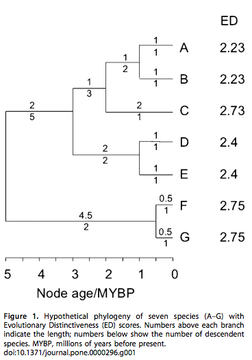

# Phylogenetic Biology - Final Project


OK, here we go.
```{r}
setwd("~/Dropbox/Brown University/BIOL1425/phylobio_final_project/")
```

# Title of my project

Sensitivity Analysis of input GE on EDGE Values

## Introduction and Goals

It seems inevitable that climate change, along with other anthropogenic factors, will continue to drive the endangerment and extinction of taxa for the immediate future. Each species is by definition a unique parcel of genetic information, which means that an extinction is the loss of a unique genome. With the number of endgangered taxa mounting, it is important to understand the ways in which species will go extinct, and what that means for the loss of phylogenetic diversity (Rolland et al 2011). EDGE values (Isaac et al 2007) are a proposed method of combining a species' probability of extinction (GE, global endangerment) with a measure of its unique evolutionary history (ED, evolutionary distinctiveness). Calculation of the evolutionary distinctiveness (ED) value is based on tree topology, where a species' score is  the total branch length from the root node to its tip, where internal branches' weight is scaled by the number of tip taxa that share that branch. 



GE is based on the transformation of IUCN Red List designation to a probability of extinction. Multiple models exist for the transformation of IUCN designations to P(ext), and the manner in which the GE score is generated may have a bearing on the resulting EDGE values and rank priorities (Mooers et al 2008). The goal of this project is to investigate the influence of different IUCN->GE transformation models on EDGE value-based conservation priority lists.

__**The methods I will use to do this are...**__

My goal is first to construct the phylogeny for Salamandridae (clade chosen for size, charisma, and importance to conservation, as many salamanders are/will become imperiled) and determine the EDGE values for each tip, feeding the branch lengths leading to each tip into the R package caper to generate ED values for each tip and using the IUCN Red List database to collect the listing status of each tip taxa. The transformation of IUCN Red List designation to a numerical probability of extinction (GE) is dependent on the model selected (Isaac, IUCN50 (probability of extinction within next 50 years), IUCN100, IUCN500). I will generate the EDGE values for my tree taxa under each of these models and rank them in priority order by EDGE value, as one would when determining which species are to be conserved based on the EDGE metric. Those species with the highest EDGE values are the "most worthy" of conservation effort. I will do a pairwise comparison of the EDGE-based priority lists generated by each model to determine the magnitude of difference between lists to determine differences in list order between models. I will also look at the top 5 species of each list, which I take to be representative of the species most worthy of conservation under each model. 

__**The data I will use are (my own data/ data publicly available at YYY/ simulations)**__

I am drawing my data entirely from the supplementary table of accession numbers provided in Pyron 2011.

____________

## Methods

I started by downloading the accession numbers for 12 genes published Pyron 2011, used in the construction of a comprehensive Amphibia phylogeny, storing them in a data frame called accessions.  

```{r}
accessions=read.csv("Pyrondata.csv",header = TRUE)
# data is from Pyron 2011
row.names(accessions)=accessions[,1]
specieslist=accessions[,1]
accessions=accessions[-2873,]
accessions=accessions[,-1]
dim(accessions)
accessions[1,]

```
I then downloaded a list of all the IUCN designations for species within Salamandridae from the IUCN Red List database (http://www.iucnredlist.org/), storing it locally as a .csv and within the R environment as IUCN_salamandridae.
```{r}
IUCN_salamandridae=read.csv("IUCN_salamandridae.csv", header = TRUE)
dim(IUCN_salamandridae)
#76 species of salamanders in IUCN database
names(IUCN_salamandridae)
row.names(IUCN_salamandridae)=IUCN_salamandridae[,4]
IUCN_salamandridae=IUCN_salamandridae[,-4]
```
By searching the row names of each dataframe, I pared down the rows in accessions so that I only look at species with designations in the IUCN database. This left me with 65 salamandridae species for phylogenetic analysis.
```{r}
accessions=accessions[rownames(accessions)%in%rownames(IUCN_salamandridae),]
dim(accessions)
accessions[1,]
```
After looking at the accessions for each listed species, it became clear that the salamanders are data deficient for all genes except x12s, x16s, and cytb. For that reason, I dropped the other 9 genes from my analysis.
```{r}
accessions=accessions[,-c(4:12)]
```
I then created an IUCN_salamandridae_matched dataframe, which listed only those rows which are in accessions, effectively creating two dataframes with identical rows.
```{r}
IUCN_salamandridae_matched=IUCN_salamandridae[rownames(IUCN_salamandridae)%in%rownames(accessions),]
dim(IUCN_salamandridae_matched)
names(IUCN_salamandridae_matched)
```
I then went into the matched IUCN dataframe and extracted the Red_list_status and Red_list_criteria columns and appended them to my accessions dataframe. 
```{r}
accessions[,4]=IUCN_salamandridae_matched[,7]
accessions[,5]=IUCN_salamandridae_matched[,8]
accessions[,6]=IUCN_salamandridae_matched[,11]
names(accessions)[4]="Red_list_status"
names(accessions)[5]="Red_list_criteria"
names(accessions)[6]="population_trend"
names(accessions)
dim(accessions)

```
I then exported my accessions dataframe to a .csv file
```{r}
write.csv(accessions,file = "accessions_salamandridae.csv")
```

Accessions for X12s, X16s, and cytb were imported into the Batch Entrez search engine in GenBank and compiled as FASTA files, aligned with mafft under default parameters, and concatenated using phyutility.jar. Alignments were checked for overall consistency in Mesquite. Several taxa had reverse complements stored in GenBank, and these sequences were manually excised from the FASTA files, run through a reverse complement tool (http://www.bioinformatics.org/sms/rev_comp.html) and reentered. 

I removed T.vittatus sequence from x12s.fasta because it would not align (tried inputting the reverse complement without success). I assume this was because of input error.

All three genes and the concatenated dataset were run on RAxML to get ML trees(see analysis files).

For simplicity's sake, I will show only the concatenated tree.

```{r Figure 1}
library(ape)
library(caper)
sala.concat.tree=read.tree("sala_data/concat.reduced_tree/RAxML_bestTree.concat.reduced_boot100")
plot(sala.concat.tree,cex = 0.3)
#Figure 1: ML tree from concatenated salamander data (X12s,X16s,cytb genes).
```
I next converted the tree into a clade matrix using R package caper's clade.matrix() function. This is the necessary data format for the use of caper's ED calculating function, ed.calc(). I also ordered the ED values in descending order.
```{r}
sala.concat.tree=clade.matrix(sala.concat.tree)
ED_sala.concat=ed.calc(sala.concat.tree)
ED_sala.concat=data.frame(ED_sala.concat$spp)
ED_sala.concat=ED_sala.concat[order(ED_sala.concat[,1]),]
```
I next passed the IUCN designations to the dataframe containing the ED values.
```{r}
IUCN_salamandridae_matched=IUCN_salamandridae_matched[rownames(IUCN_salamandridae_matched)%in%ED_sala.concat[,1],]

ED_sala.concat=ED_sala.concat[ED_sala.concat[,1]%in%rownames(IUCN_salamandridae_matched),]

ED_sala.concat[,3:4]=IUCN_salamandridae_matched[,c(7,11)]
```
Next, I built a function to generate the EDGE values of an input ED dataframe using a given model's GE transformation. GE transformations are drawn from IUCN 2001 and Isaac 2007.
```{r}
get.EDGE=function(matrix,model){
  matrix[,5]=NA
  #create 5th column
  if (model=="Isaac"){
    matrix[which(matrix[,3]=="CR"),5]=log(matrix[which(matrix[,3]=="CR"),2]*.4)
    matrix[which(matrix[,3]=="EN"),5]=log(matrix[which(matrix[,3]=="EN"),2]*.2)
    matrix[which(matrix[,3]=="VU"),5]=log(matrix[which(matrix[,3]=="VU"),2]*.1)
    matrix[which(matrix[,3]=="NT"),5]=log(matrix[which(matrix[,3]=="NT"),2]*.05)
    matrix[which(matrix[,3]=="LC"),5]=log(matrix[which(matrix[,3]=="LC"),2]*.025)
  }
  if (model=="IUCN50"){
    matrix[which(matrix[,3]=="CR"),5]=log(matrix[which(matrix[,3]=="CR"),2]*.97)
    matrix[which(matrix[,3]=="EN"),5]=log(matrix[which(matrix[,3]=="EN"),2]*.42)
    matrix[which(matrix[,3]=="VU"),5]=log(matrix[which(matrix[,3]=="VU"),2]*.05)
    matrix[which(matrix[,3]=="NT"),5]=log(matrix[which(matrix[,3]=="NT"),2]*.004)
    matrix[which(matrix[,3]=="LC"),5]=log(matrix[which(matrix[,3]=="LC"),2]*.00005)
  }
  if (model=="IUCN100"){
    matrix[which(matrix[,3]=="CR"),5]=log(matrix[which(matrix[,3]=="CR"),2]*.999)
    matrix[which(matrix[,3]=="EN"),5]=log(matrix[which(matrix[,3]=="EN"),2]*.667)
    matrix[which(matrix[,3]=="VU"),5]=log(matrix[which(matrix[,3]=="VU"),2]*.1)
    matrix[which(matrix[,3]=="NT"),5]=log(matrix[which(matrix[,3]=="NT"),2]*.01)
    matrix[which(matrix[,3]=="LC"),5]=log(matrix[which(matrix[,3]=="LC"),2]*.0001)
  }
  if (model=="IUCN500"){
    matrix[which(matrix[,3]=="CR"),5]=log(matrix[which(matrix[,3]=="CR"),2]*1)
    matrix[which(matrix[,3]=="EN"),5]=log(matrix[which(matrix[,3]=="EN"),2]*.996)
    matrix[which(matrix[,3]=="VU"),5]=log(matrix[which(matrix[,3]=="VU"),2]*.39)
    matrix[which(matrix[,3]=="NT"),5]=log(matrix[which(matrix[,3]=="NT"),2]*.02)
    matrix[which(matrix[,3]=="LC"),5]=log(matrix[which(matrix[,3]=="LC"),2]*.0005)
  }
  matrix[,5]=abs(matrix[,5])
  colnames(matrix)[5]="EDGE"
  matrix=matrix[order(matrix[,5],decreasing = TRUE),]
  #EDGE values column in decreasing order
  matrix[6]=1:dim(matrix)[1]
  colnames(matrix)[6]="rank by edge"
  #rank each by order
  return(matrix[,c(1,5,6)])
}
```
Now, I get the EDGE values.
```{r}
sala.concat.Isaac=get.EDGE(matrix = ED_sala.concat,"Isaac")
sala.concat.50=get.EDGE(matrix = ED_sala.concat,model = "IUCN50")
sala.concat.100=get.EDGE(matrix = ED_sala.concat,"IUCN100")
sala.concat.500=get.EDGE(matrix = ED_sala.concat,model = "IUCN500")
```
Here, I print the top 5 species for each transformation's EDGE priority list.
```{r}
sala.concat.Isaac[1:5,]
sala.concat.50[1:5,]
sala.concat.100[1:5,]
sala.concat.500[1:5,]
```
Next, I built a function to examine the degree of difference between the priority lists generated by the function get.EDGE(). It compares the rank of a species in EDGE list 1 to the rank of that same species in EDGE list 2. The absolute value of the difference in those two ranks is summed over all species.
```{r}
rank.distance=function(matrix1,matrix2){
  counter<-0
  for (i in 1:dim(matrix1)[1]){
    pairdiff<-abs(matrix1[i,3]-matrix2[which(matrix2[,1]==matrix1[i,1]),3])
    counter<-counter+pairdiff
  }
  print(counter)
}
```
Next, I print the distances between the EDGE lists of each model.
```{r}
#rank.distance to Isaac model
rank.distance(sala.concat.Isaac,sala.concat.Isaac)
rank.distance(sala.concat.Isaac,sala.concat.50)
rank.distance(sala.concat.Isaac,sala.concat.100)
rank.distance(sala.concat.Isaac,sala.concat.500)

#rank.distance to IUCN50
rank.distance(sala.concat.50,sala.concat.Isaac)
rank.distance(sala.concat.50,sala.concat.50)
rank.distance(sala.concat.50,sala.concat.100)
rank.distance(sala.concat.50,sala.concat.500)

#rank.distance to IUCN100 
rank.distance(sala.concat.100,sala.concat.Isaac)
rank.distance(sala.concat.100,sala.concat.50)
rank.distance(sala.concat.100,sala.concat.100)
rank.distance(sala.concat.100,sala.concat.500)

#rank.distance to IUCN500 
rank.distance(sala.concat.500,sala.concat.Isaac)
rank.distance(sala.concat.500,sala.concat.50)
rank.distance(sala.concat.500,sala.concat.100)
rank.distance(sala.concat.500,sala.concat.500)

```

See analysis files at (https://github.com/wsano16/phylobio_final_project.git).
  
## Results

The output of the rank.distance() function shows discord between the four proposed models. There is obviously no distance between the priority lists generated from the same transformation model, but there are significant departures in priority list order across models. The Isaac model shows a dramatic difference from all IUCN models, likely because it follows an discordant ranking scheme (P(ext)[VU]=.1 in 100 years, P(ext) doubles as you go up (VU->EN)). IUCN transformations do not follow this patter. The Isaac list is most similar to the IUCN100 model, which is reasonable, given that the Isaac model is also designed around a 100 year framework.

Within the IUCN lists we see an increasing degree of discordance from IUCN50->IUCN50100->IUCN50500. 

Across all 4 models, the top 5 species on the EDGE priority lists are identical.
```{r}
sala.concat.Isaac[1:5,]$species
sala.concat.50[1:5,]$species
sala.concat.100[1:5,]$species
sala.concat.500[1:5,]$species
```
## Discussion

These results indicate that model selection for GE transformation is indeed important to the ranking of species for conservation by EDGE value. EDGE-value based conservation priority lists are, indeed, sensitive to the GE model employed in their construction. 

More interestingly, however, is that the top priority species (I abitrarily decided that there would be 5), are consistent across the lists. Each GE model generates a different priority list for the conservation of the salamanders in question, but the top five always the same. So the sensitivity of these conservation priority lists to GE transformation model is maybe not as crippling to the implementation of EDGE-value-based conservation as it might seem. If only considering top priority species in these lists, the GE model chosen for list construction is relatively unimportant. This means that the IUCN Red List designation of species *can* be integrated into phylogenetic analyses for the sake of identifying only those species most in need of conservation. Basing management plans for species deeper in the list is likely ill-advised, since there is so much instability in the lists. 

The biggest difficulty in implementing these analyses was in tree construction. I wanted my tree to be highly resolved and without any polytomies, but I think the level of data/number of genes that I used in my analyses was insufficient to produce a fully resolved tree. Were I to do this analysis again, I would spend more time on tree construction and data collection to ensure that my output tree is sound. At this point, I cannot be sure of the degree to which my ED values could be wrong and how those might be affecting my results. 

I am still curious about how ED accumulates in the tree. Branch contribution to ED value is greatest near the tips (fewer taxa sharing that branch), so there is likely a point in a phylogeny where ED stops accumulating (Kamran 2013). I investigated the role of GE on priority rankings, btu I am now curious about ED and how the depth of a tree and number of tips might influence EDGE listing priorities. 


## References

Davies, T. Jonathan, Gideon F. Smith, Dirk U. Bellstedt, James S. Boatwright, Benny Bytebier, Richard M. Cowling, Félix Forest, Luke J. Harmon, A. Muthama Muasya, Brian D. Schrire, Yolande Steenkamp, Michelle Van Der Bank, and Vincent Savolainen. "Extinction Risk and Diversification Are Linked in a Plant Biodiversity Hotspot." PLoS Biology PLoS Biol 9.5 (2011): Web. <http://journals.plos.org/plosbiology/article?id=10.1371/journal.pbio.1000620>.

Isaac, Nick J.b., Samuel T. Turvey, Ben Collen, Carly Waterman, and Jonathan E.m. Baillie. "Mammals on the EDGE: Conservation Priorities Based on Threat and Phylogeny." PLoS ONE 2.3 (2007): Web. 28 Apr. 2016. <http://journals.plos.org/plosone/article/asset?id=10.1371/journal.pone.0000296.PDF>.

IUCN., IUCN Red List Categories and Criteria version 3.1. Cambridge: IUCN Species Survival Commission (2001).
<http://www.iucnredlist.org/technical-documents/categories-and-criteria/2001-categories-criteria>

Kamran, Safi. "Global Patterns of Evolutionary Distinct and Globally Endangered Amphibians and Mammals." (2013): n. pag. PLOS One. Web. 3 May 2016. <http://journals.plos.org/plosone/article?id=10.1371/journal.pone.0063582>.

Mooers, Arne Ø., Daniel P. Faith, and Wayne P. Maddison. "Converting Endangered Species Categories to Probabilities of Extinction for Phylogenetic Conservation Prioritization." PLoS ONE 3.11 (2008): n. pag. Web. 3 May 2016. <http://journals.plos.org/plosone/article?id=10.1371/journal.pone.0003700>.

Purvis, A. "Nonrandom Extinction and the Loss of Evolutionary History." Science 288.5464 (2000): 328-30. Web. <http://science.sciencemag.org/content/288/5464/328>.

Pyron, R. Alexander, and John J. Wiens. "A Large-scale Phylogeny of Amphibia including over 2800 Species, and a Revised Classification of Extant Frogs, Salamanders, and Caecilians." Molecular Phylogenetics and Evolution 61.2 (2011): 543-83. Web. 28 Apr. 2016. <http://www.sciencedirect.com/science/article/pii/S105579031100279X>.

Rolland, J., M. W. Cadotte, J. Davies, V. Devictor, S. Lavergne, N. Mouquet, S. Pavoine, A. Rodrigues, W. Thuiller, L. Turcati, M. Winter, L. Zupan, F. Jabot, and H. Morlon. "Using Phylogenies in Conservation: New Perspectives." Biology Letters 8.5 (2011): 692-94. Web. <http://rsbl.royalsocietypublishing.org/content/early/2011/11/21/rsbl.2011.1024>.

Thuiller, Wilfried, Sébastien Lavergne, Cristina Roquet, Isabelle Boulangeat, Bruno Lafourcade, and Miguel. B. Araujo. "Consequences of Climate Change on the Tree of Life in Europe." Nature 470.7335 (2011): 531-34. Web. <http://www.nature.com/nature/journal/v470/n7335/full/nature09705.html>.


